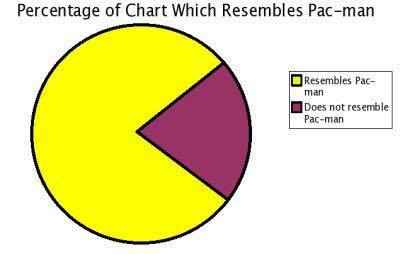
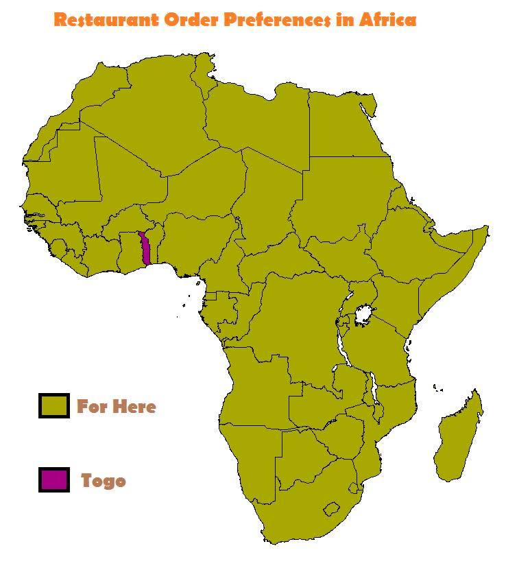

# firstWeekIntroduction-S17

## Table of Contents
- [Abstract](#abstract)
- [Contributor](#contributor)
- [Important Links](#important-links)
- [Languages Known](#languages-known)
- [Favorite Songs](#favorite-songs)
- [Favorite Memes](#favorite-memes)

## Abstract
Economics and Statistics double major, interested in the intersection of the two fields.
_"I am a great believer in luck. The harder I work, the more of it I seem to have."_ - Coleman Cox

## Contributor
Jun Seo Park

## Important Links
Linkedin: [http://www.linkedin.com/in/junseopark](http://www.linkedin.com/in/junseopark)
Github: [http://www.github.com/junseo-park](http://www.github.com/junseo-park)
Inertia7: TBA
Email: [junseopark12@gmail.com](mailto:junseopark12@gmail.com)

## Languages Known
|Language       |Skill Level    | Preference for Project (1 to 5)|
|---------------|---------------|---------------------------------|
|English        |Advanced       |5                                |
|Korean         |Advanced       |2                                |
|French         |Proficient     |1                                |
|Python         |Intermediate   |4                                |
|R              |Basic syntax   |5                                |
|SQL            |n00b           |5                                |

### Languages I want to learn
SQL

## Favorite Songs
- Adele - All I Ask
- Code Kunst - StrOngerrr (feat. Loco & Mino)
- Kendrick Lamar - King Kunta
- Ariana Grande - Almost is Never Enough (feat. Nathan Sykes)

## Favorite Memes
  
  
